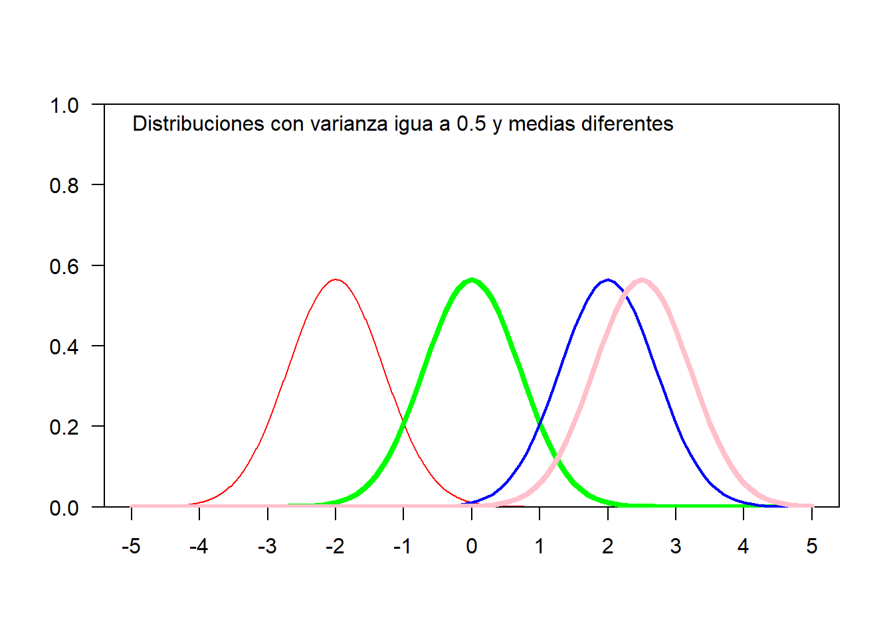
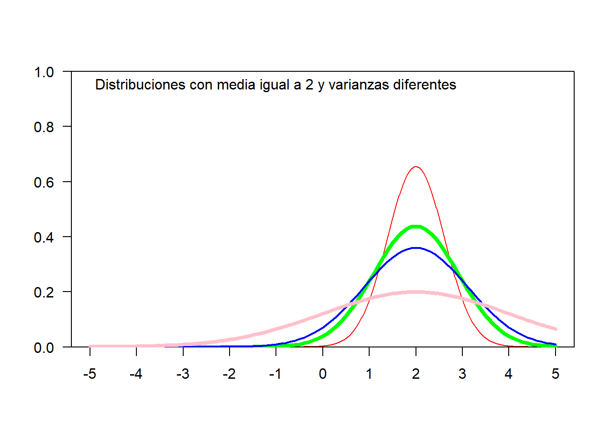
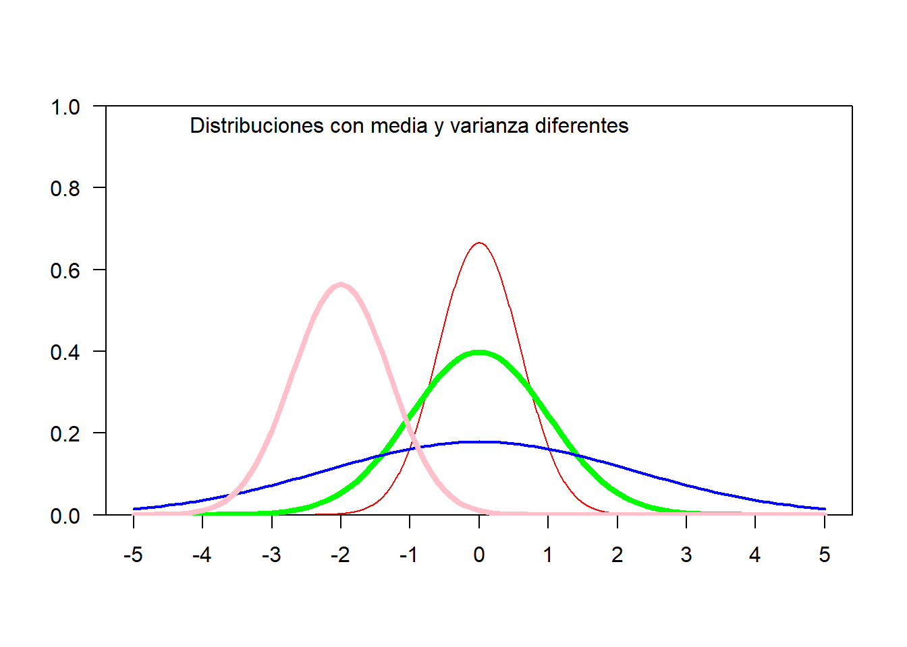
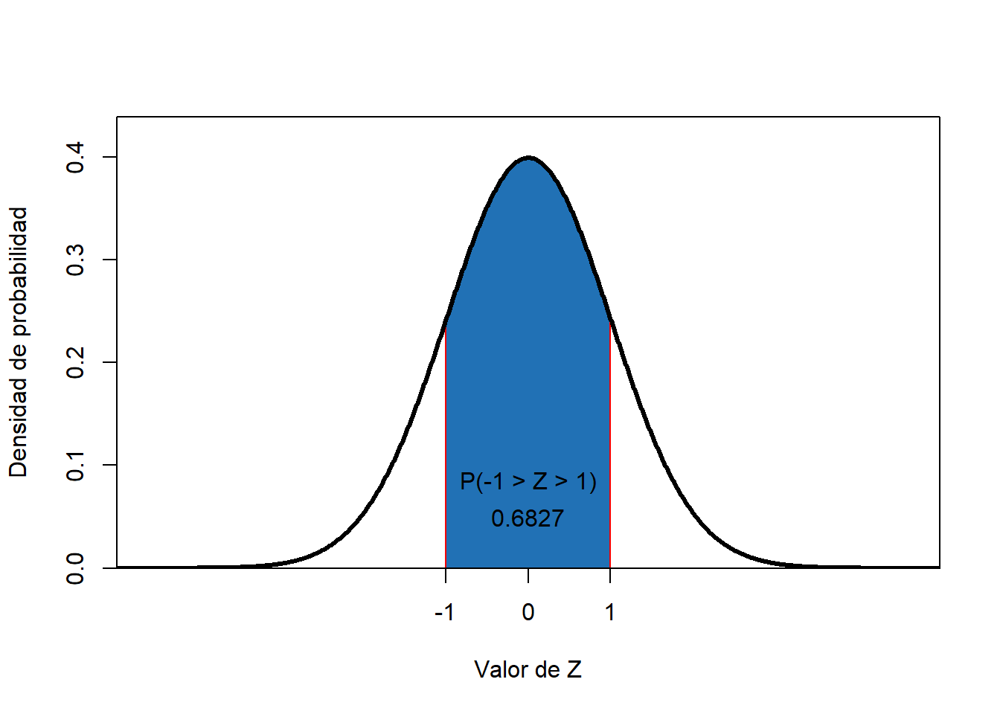
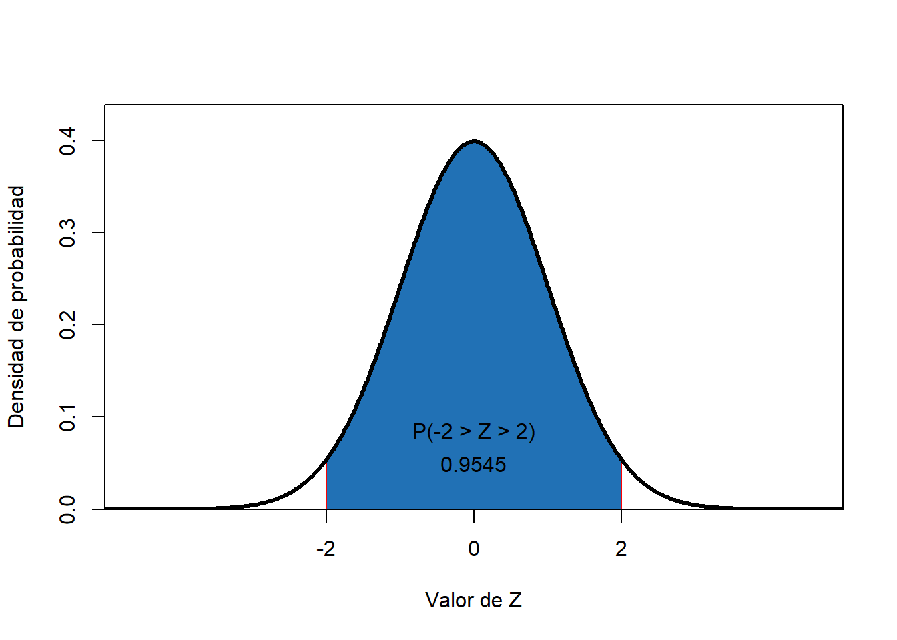
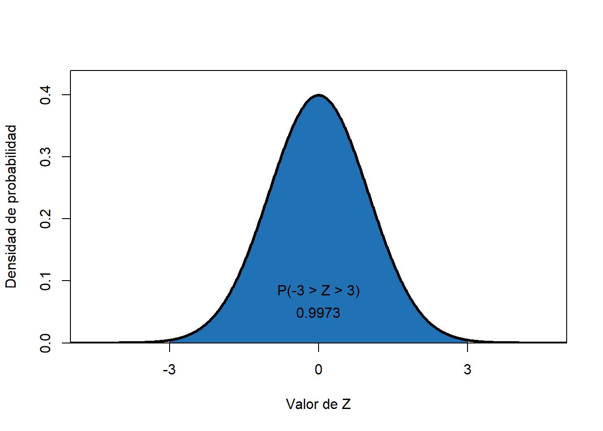

# Características de la Distribución

##  Es una Distribución contínua 

##  Es Simétrica. 

##  Es asintotica.

##  Está centrada en la media, $E(x) = \mu$.

##  La media, la moda y la mediana coinciden en el mismo punto.

##  Tiene dos puntos de inflexión.

La primera derivada de la función es:
$$f'(x)=\frac{1}{\sigma\sqrt{2\pi}}(-\frac{2(x-\mu)}{2\sigma^2})e^{-\frac{(x-\mu)^2}{2\sigma^2}}=-f(x)\frac{x-\mu}{\sigma^2}$$
Igualando a cero se tiene que los puntos críticos son $x = \mu$ y $x=\infty$

  La segunda derivada será:

$$f''(x)=f(x)\frac{(x-\mu)-\sigma^2}{\sigma^4}$$

Como la segunda derivada, evaluada en \(\mu\) es negativa, se concluye que la función tiene un máximo en $x = \mu$.  Con esto, la media es también la moda de la distribución.

Es fácil ver que la función cuenta con dos puntos de infexión en $x = \mu ± \sigma$ y que, para cualquier valor, $a$ se verifica que $f(\mu+a)=f(\mu-a)$: por lo tanto **es una función simétrica**.

**_____________________________________________________________________**

## Los parámetros determinan su forma y posición. 

Cambios en la media implican una translación de la curva. Las graficas siguientes muestran distribuciones normales, todas con el mismo valor en el parámetro de dispersión, $\sigma=0.5$ pero media diferente.

Si ocurren cambios en el parámetro de dispersión la curva presenta curtosis diferente.  Las graficas que siguen muestran distribuciones con igual valor en el parámetro central, pero con variaciones en la dispersión.

## Para la distribución normal se cumplen las siguientes proporciones

### $P(-1<x<1)=0.6826$
### $P(-2<x<2)=0.9544$
### $P(-3<x<3)=0.9974$

Por el teorema de TChevichev se tiene que:

$$P(|x - \mu| \le k \ \sigma) = P(|Z| \le k )$$
**Para $k=1$**

**Para $k=2$**

**Para $k=3$**

## El mejor estimador lineal para $\mu$ es $\bar x= \frac{\sum_{i=1}^n x_i}{n}$

## El mejor estimador lineal para $\sigma$ es $S^2=\frac{\sum_{i=1}^n (x_i-\mu)^2}{n-1}$

## La distribución de una variable aleatoria que se origine en la transformación lineal de una variable normal, también es normal.

Si X es v.a. normal, cuando se hace Y = a + bX, entonces Y tendrá distribución normal.

## Propiedad reproductiva

Si se tiene un conjunto de v.a., $X_1, X_2, ..., X_k$, $iid \ \eta(\mu_i;\sigma^2_i)$ si se hace
$Y=\sum_{i=1}^k X_i$, entonces $Y \tilde  \,\eta(\sum_{i=1}^k \mu_i;\sum_{i=1}^k \sigma^2_i)$

**__________________________________________________**
