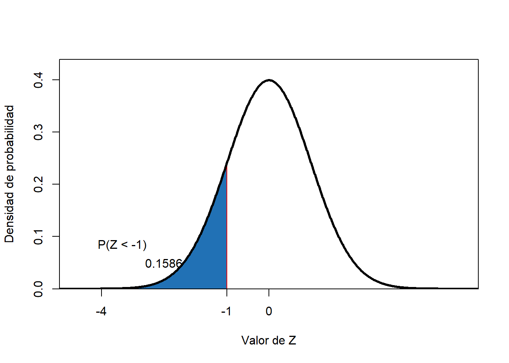
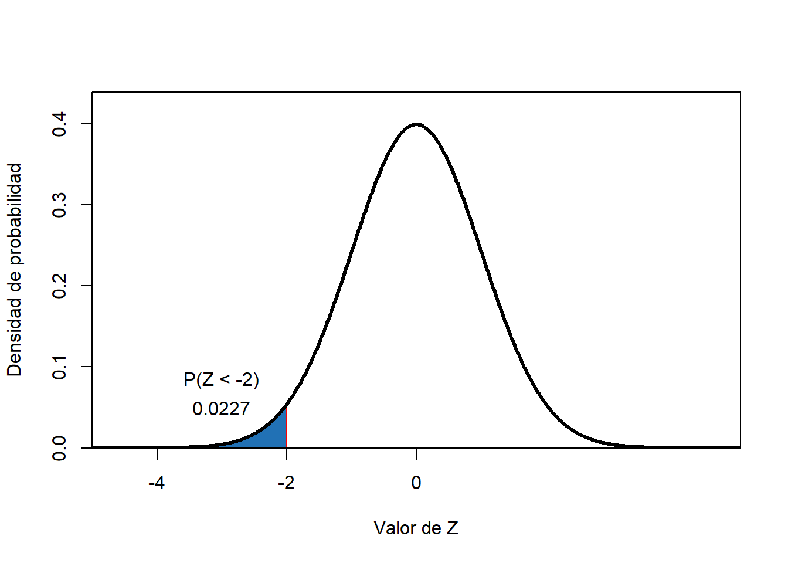
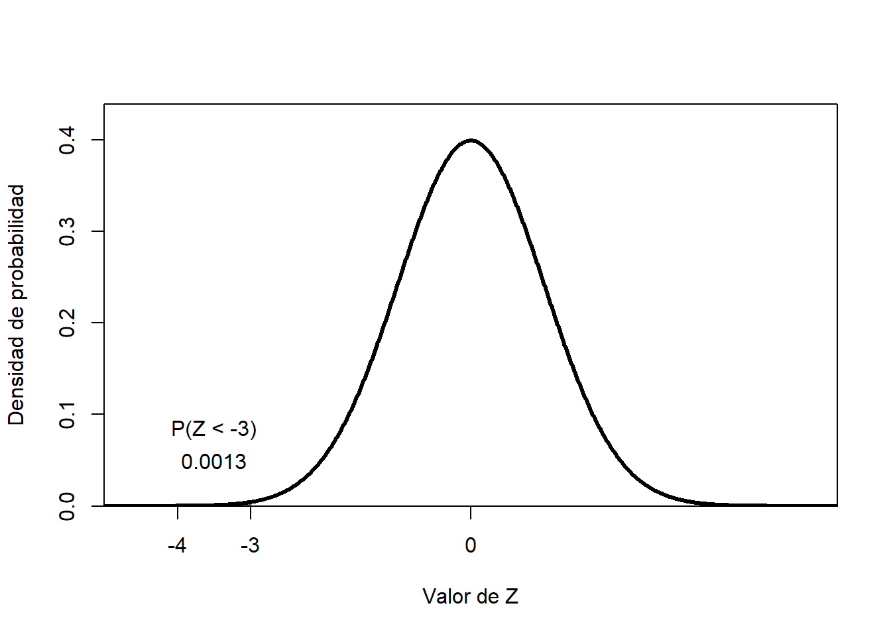

# Estimación de probabilidades

La probabilidad estimada por el modelo de distribución normal se obtiene por integración bajo la curva.  Así, $P(a<x<b)=\int_a^bf(x)dx$.

Para el caso de una $X \,\ \tilde \,\ \eta \ (\mu; \sigma^2)$,

$$P(a< x <b)= \int_{a}^b \frac{1}{({2 \pi})^{1/2} \sigma}e^{-\frac{1}{2}({\frac{x- \mu}{\sigma}})^2}dx$$

¿Cuál es la probabilidad de que $Z \,\ \tilde \,\ \eta \ (\mu= 0; \sigma^2 = 1)$ asuma valores inferiores a -1?

¿Cuál es la probabilidad de que $Z \,\ \tilde \,\ \eta \ (\mu= 0; \sigma^2 = 1)$ asuma valores inferiores a -2?

¿Cuál es la probabilidad de que $Z \,\ \tilde \,\ \eta \ (\mu= 0; \sigma^2 = 1)$ asuma valores inferiores a -3?

**______________________________________________________________________**

[LA FUNCIÓN](#function)

