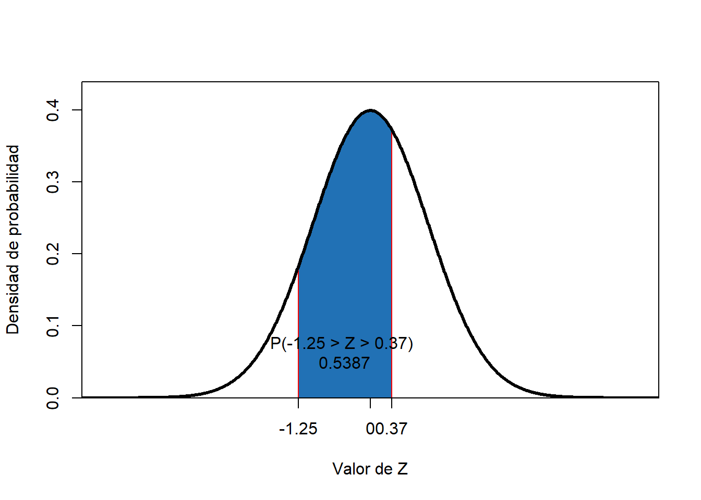

# Otras probabilidades en la normal estándar

**______________________________________________________________________**

**Algunos percentilies comúnmente estimados son:**

¿Cuánto vale $k$ si $P(Z < -0.8416212) = k$?

**____________________________________________**

