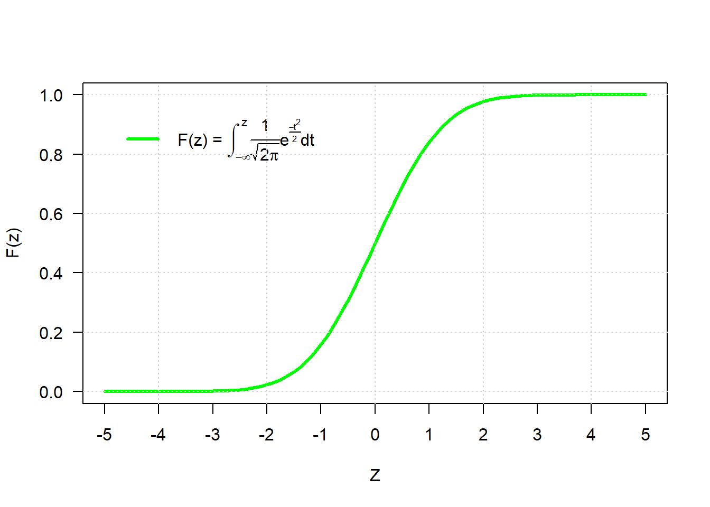
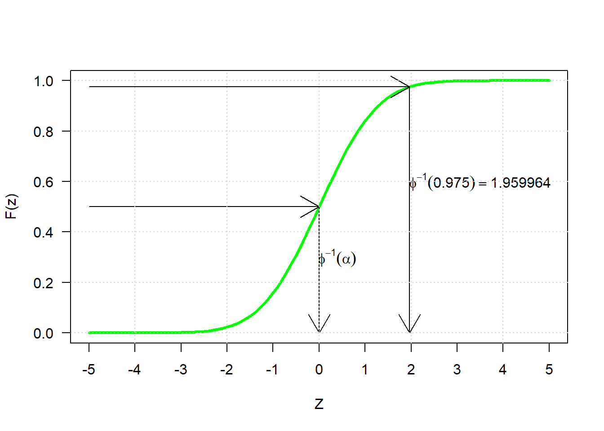

# La función PROBIT

Si 

$$f(x; \mu; \sigma)= \frac{1}{({2 \pi})^{1/2} \sigma}e^{-\frac{1}{2}({\frac{x- \mu}{\sigma}})^2}$$

Entonces

$$F(x)=P(X < x)= \int_{- \infty}^x \frac{1}{({2 \pi})^{1/2} \sigma}e^{-\frac{1}{2}({\frac{t- \mu}{\sigma}})^2}dt = \phi(x)$$

$F(x)$ es la función de distribución Acumulada de la V.A. X

**_____________________________________________________________________**

## Definición

$$Probit (\alpha) = \phi ^{-1}(\alpha)$$
Probit de $\alpha$ es el valor de Z que tiene como acumulado una probabilidad $\alpha$.

¿Cuánto vale el percentil 10 de la normal estandar?

$$P_{10}= Probit(0.1)= -1.2815516 $$

¿Cuánto vale k si $P(Z < k) = 0.975$ ?

$$k = Probit(0.975)= 1.959964 $$

¿Cuánto vale k si $P(Z < k) = 0.025$ ?

$$k = Probit(0.025)= -1.959964 $$

**________________________________________________________**

