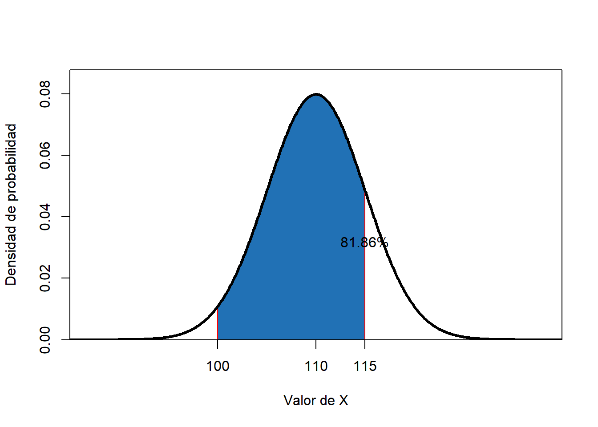
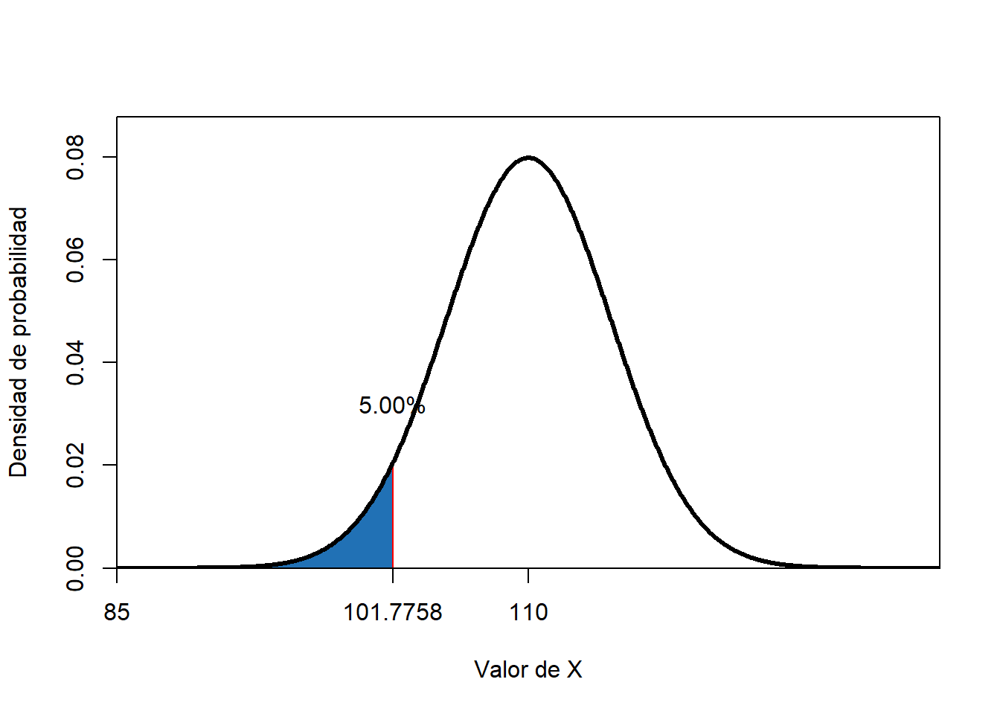
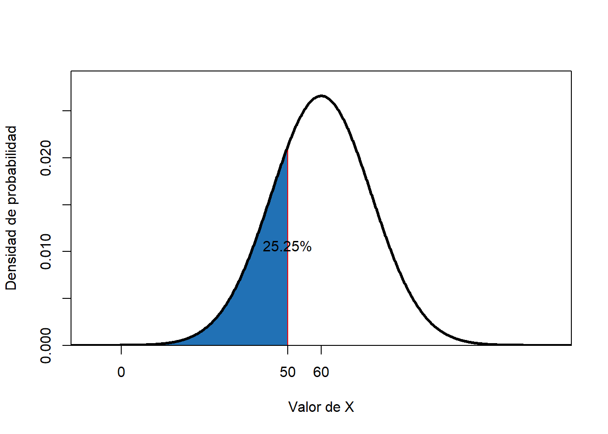
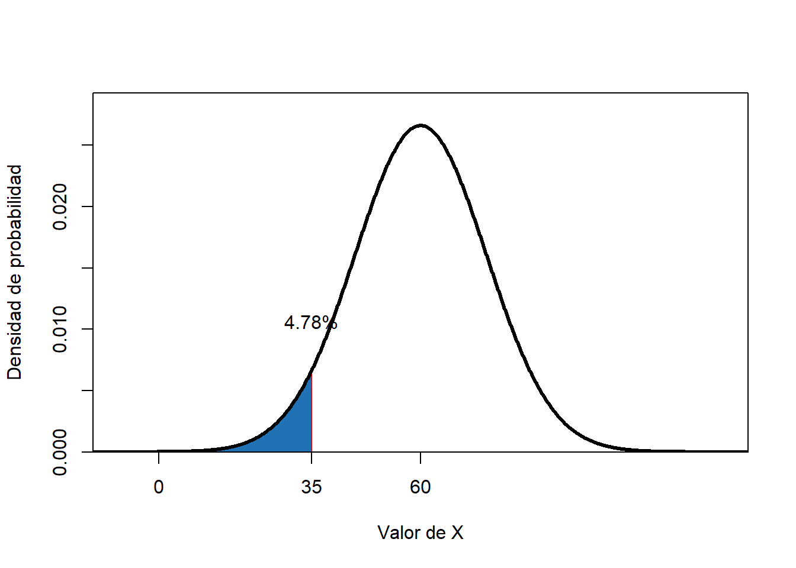
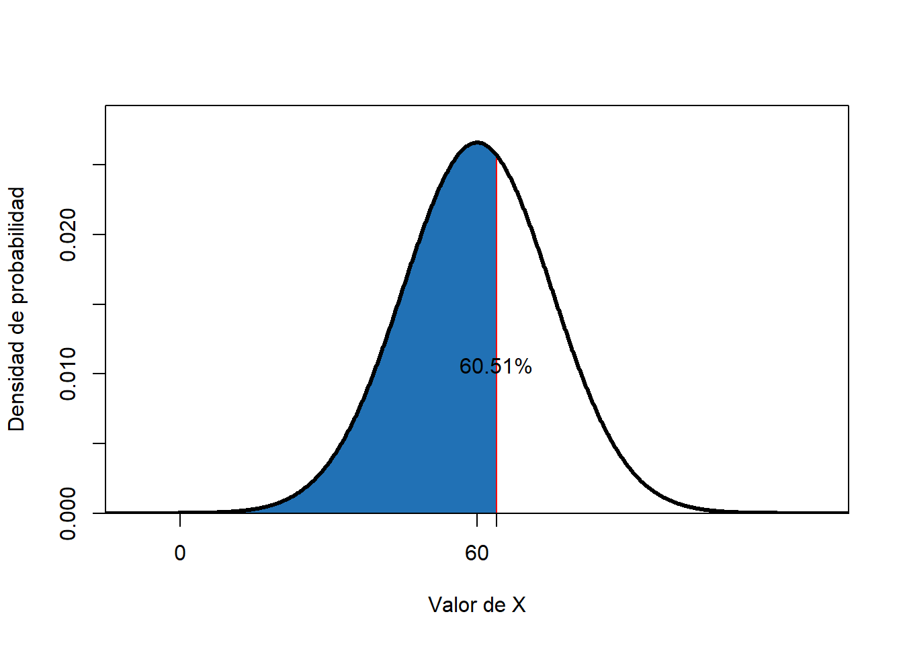

# Estimación de probabilides usando la normal estandar

## *Teorema* {-}

Si $X$ es una v.a. que tiene media y varianza finita, $E(x)=\mu$ y $Var(x)=\sigma^2$

Cuando se hace 

$$Y = \frac{x-E(x)}{\sqrt{Var(x)}}$$

  Entonces, $Y$ tendrá $E(x)= \mu = 0$ y $Var(x)=\sigma^2 = 1$

Se dice que $X$ ha sido **Estandarizada** y la nueva variable tendrá media **cero** y **varianza = 1**.

  Si $X$ es normal o aproximadamente normal, 
 $$Y \,\ \tilde \,\ \eta \ (\mu= 0; \sigma^2 = 1)$$
 
 

**________________________________________________________**

  Con esto, se pueden estimar probabilidades para variables aleatorias normales (o aproximadamente normales) de la siguiente forma:

Si $X$ es una v.a. con $E(x)=\mu$ y $Var(x)=\sigma^2$

$$P(a<x<b)=$$

$$P(\frac{a-\mu}{\sigma}<\frac{x-\mu}{\sigma}<\frac{b-\mu}{\sigma})=$$

Haciendo 

$$z_a=\frac{a-\mu}{\sigma}$$ y 

$$z_b=\frac{b-\mu}{\sigma}$$ 

se tiene que:

$$P(a<x<b)= P\ (\ z_a < Z< z_b \,)$$

**_________________________________________________________________**

**Ejemplo**

Suponga que $X \,\ \tilde \,\ \eta \ (\mu= 110; \sigma^2 = 25)$.  Estime  la probabilidad

$$P(100<x<115)=$$

$$P(\frac{100-110}{5}<\frac{x-110}{5}<\frac{115-110}{5})=$$

$$P(100<x<115)= P\ (-2 < Z < 1) = 0.8413447-0.0227501=0.8185946 $$

**_________________________________________________________________**

**Ejemplo**

Estime el percentil 5, el 85  y el percentil 99 de la v.a. $X$.

**El percentil 5:   **

Al estandarizar la v.a. $X$ necesitamos encontrar un valor tal que $-1.64485=\frac{P_5-110}{5}$ ya que $P(Z<-1.64485)=0.05$

Por tanto, $P_5=101.7758$

**El percentil 85:**

Al estandarizar la v.a. $X$ necesitamos encontrar un valor tal que $1.036433=\frac{P_{85}-110}{5}$ ya que $P(Z<1.036433)=0.85$

Por tanto, $P_{85}=115.1822$

**El percentil 99:**

Al estandarizar la v.a. $X$ necesitamos encontrar un valor tal que $2.236348=\frac{P_{99}-110}{5}$ ya que $P(Z<2.326348)=0.99$

Por tanto, $P_{99}=121.6317$

**____________________________________________________________**

**Ejemplo**

Asuma que el tiempo promedio de permanencia de cierta especie en un vivero, antes de estar listas para establecer en campo, es de 60 días, con una desviación estándar de 15.

¿Cuál es la probabilidad de que una plantula esté lista  para salir en 50 días o menos?

**Respuesta**

Si X es la v.a. que cuenta el tiempo medio de permanencia de la plantula en el vivero $$X \,\ \tilde \,\ \eta \ (\mu= 60; \sigma^2 = 15^2) $$

Entonces, $P(X<50)= P(\frac{X-60}{15}<\frac{50-60}{15})=P(Z<-0.666667)$

$$P(X<50)=0.2524926$$

**____________________________________________________________________**

## La probabilidad como proporción {-}

Suponga que vivero tiene actualmente un lote de 10000 plantulas.

¿Cuántas de éstas se espera que tarden más de 75 días en salir?

**Respuesta**

$P(X >75)= P(\frac{X-60}{15}<\frac{75-60}{15})=P(Z > 1)$

$$P(X>75)=1-P(X<75)= 1-0.8413447= 0.1586553$$
Por lo tanto, se espera que, aproximadamente $n=10000*0.1586553=1586$ plantulas tandarán más de 75 días en estar listas para establecimiento.

**__________________________________________________________________**

Si para este lote de 10000, una empresa ofrece comprar todas las que estén listas entes de 35 días ¿Cuántas plantulas se espera vender?

**Respuesta**

$P(X < 35)= P(\frac{X-60}{15}<\frac{35-60}{15})=P(Z > -1.666666)$

$$P(X < 35)= 0.04779036$$
De esto, se espera vender $n= 10000*0.04779036=477$ plantulas.

**______________________________________________________________**

Suponga que el vivero inicia la produccuón de un lote de 15000 plantulas.

Si una finca solicita 9000 plantulas ¿Cuanto tiempo debería solicitar el vivero para cumplir con la entrega?

**Respuesta**

Como 9000 plantulas represnta el 60% de la producción, entonces se debe estimar el tiempo tal que $P(X < tiempo)= 0.6$.

Con esto, existe un valor de $tiempo$ tal que $P(Z < \frac{tiempo-60}{15})= 0.6$

$$Probit(0.6)=0.2533471$$
Por tanto,

$$\frac{tiempo-60}{15}=0.2533471$$
$$tiempo=60+0.2533471*15=63.8$$
El vivero debería pidir 64 días de plazo para completar la entrega.

**_________________________________________________________________**
