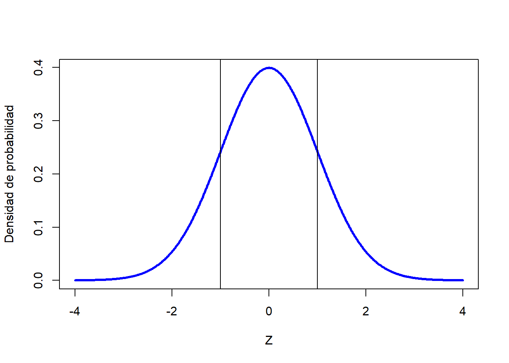
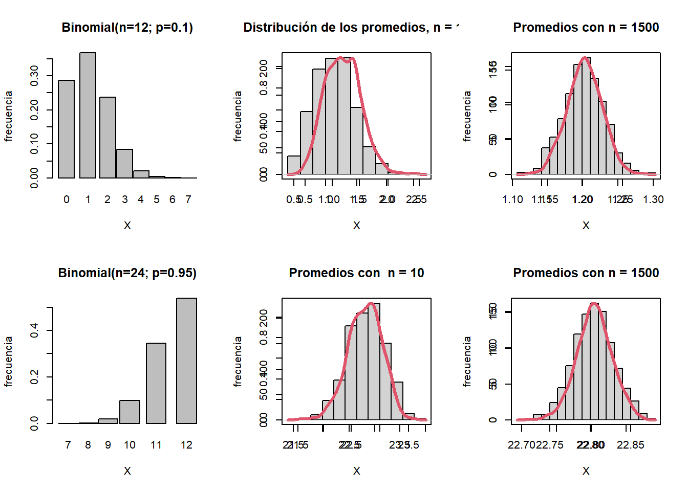

--- 
title: "Una introducción a la Estadística"
author: "Jairo Rueda-Restrepo"
date: "2023-05-23"
site: bookdown::bookdown_site
documentclass: book
bibliography: [book.bib, packages.bib]
# url: your book url like https://bookdown.org/yihui/bookdown
# cover-image: path to the social sharing image like images/cover.jpg
description: |
  Los actuales métodos de análisis de datos tiene su fundamento en la estadística clásica y bayesiana. El iniciado tiene como tarea obtener una aproximación al proceso con la descripció de los datos; bien sea desde gráficos, bien desde estadígrafos. En esta introducción se presenta los básico de la estadística Descriptiva,... hasta la técnica de inferencia por contrate de hipótesis para la comparación de dos medias muestrales.  En el intermedio se presentan los modelos que se consideranron más importantes para variables aleatorias discretas.
biblio-style: apalike
csl: chicago-fullnote-bibliography.csl
---

# Distribución Normal {#function}

La distribución normal es la más importante de todas las distribuciones de probabilidad. Es una distribución para variables aleatorias continuas en el intervalo ($-\infty ,\infty$). 

La distribución normal se conoce como la curva de Gauss o campana de Gauss (Karl Friedrich Gauss), matemático alemán del siglo IXX.

Una de las primeras aplicaciones de la distribución normal fue al análisis de errores de medición realizados en observaciones astronómicas.
En el siglo XVII, Galileo en el análisis de errores de medición de observaciones astronómicas observó que los 
errores atribuibles a la instrumentación y a los observadores presentaban un patrón que luego Gauss describe. 
Tanto Galileo como Gauss notarón que estos errores eran simétricos y que los pequeños errores eran más frecuentes que los errores grandes. 
Esto llevó a varias distribuciones hipotéticas para la distribución de los errores, pero no fue hasta principios del siglo IXX cuando se descubrió que dichos errores  siguen una distribución normal.

$$ f(x; \mu; \sigma)= \frac{1}{({2 \pi})^{1/2} \sigma}e^{-\frac{1}{2}({\frac{x- \mu}{\sigma}})^2} $$

$-\infty<x<\infty$

$\pi=3.141592...$

$0<\sigma<\infty$: parámetro de dispersión 

$-\infty<\mu<\infty$: parámetro central

$e= 2.718282...$, Base de los logarítmos Neperianos

Abraham de Moivre, estadístico del siglo XVIII y consultor de los apostadores, señaló que cuando el número de experimentos Bernoulli aumentaba, la forma de la distribución binomial se acercaba a una curva muy suave. 

Las distribuciones binomiales para tamaños de muestra, n = 10 y n = 1500 se muestran en la Figura anterior.  Note que aunque las distribuciones son asimétricas, las distribuciones para los promedios tienden a ser simétricas, **normales**.

De Moivre se palnteó el problema de encontrar la expresión matemática para esta curva para resolver problemas vinvulados a la realización de experimentos Binomiales con un gran número de ensayos. 

La mayoría de los procedimientos estadísticos para probar diferencias entre medias asumen distribuciones normales.
 
Laplace, al derivar el Teorema del Límite central \@ref(#TLC) (en 1778) mostró que incluso si una distribución no se distribuye normalmente, los promedios aritméticos de muestras repetidas
de la distribución estarían distribuidas aproximadamente normal, y que cuanto mayor sea el tamaño de la muestra, más cerca estaría
 la distribución de los promedios a una distribución normal.

Debido a que la distribución de los promedios, para grandes tamaños de muestra, es muy cercana a lo normal, las aplicaciones de la distribución normal funcionan bien aunque la distribución original sólo sea aproximadamente normal.

El modelo de distribución normal debe su importancia a tres razones fundamentales:

Por un lado, un gran número de fenómenos reales se pueden describir usando esta modelo de distribución. Por otro lado, muchas de las distribuciones de uso frecuente tienden a
aproximarse a la distribuciÛn normal bajo ciertas condiciones; y, por  último, en virtud
del Teorema Central del LÌmite, todas aquellas variables que puedan considerarse
causadas por un gran número de pequeños efectos (como pueden ser los errores de
observación) tienden a distribuirse como una distribución normal.

**__________________________________________________**
